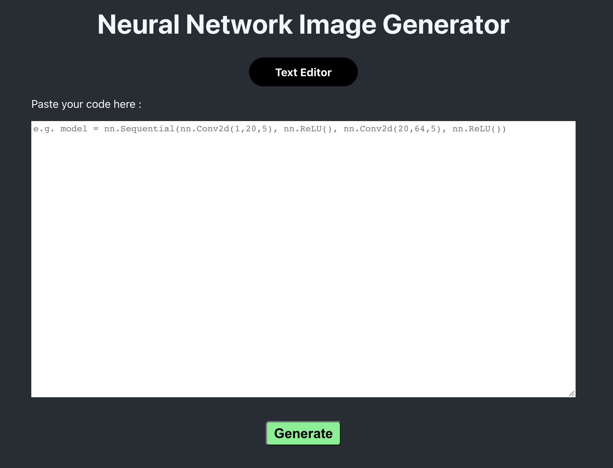
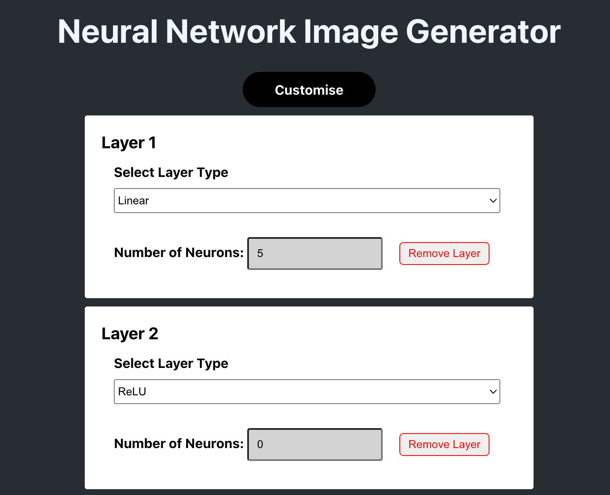
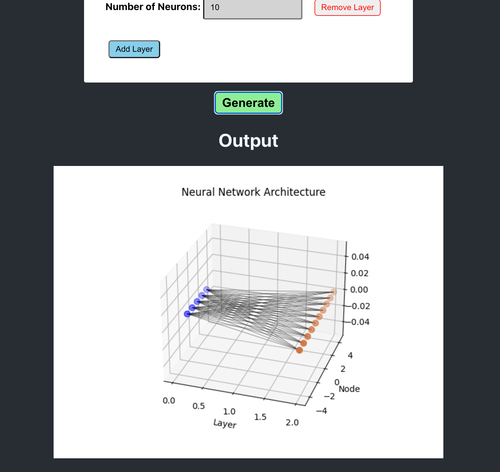

# Neural Network Image Generator Web Tool

This is a web tool that combines Flask for backend development and React for frontend implementation to provide customizable 3D visualizations of neural network architectures based on user inputs.

## Testing Backend Server

  

## Frontend UI

 Users can toggle between "Text Editor" and "Customisation" modes to generate the image 

### Text Editor Mode

  
  
Users can simply copy and paste their pytorch neural network code into the textbox

### Customisation Mode

    
    
Users can select and customise the layers they want from scratch here as well

    
For this project, we limited to only 2 types of layers: Linear and Activation Functions (ReLU, Sigmoid, Tanh, LeakyReLU, Softmax) 

### Output 

    
    
Upon pressing the "Generate" button, the neural network image will be displayed at the bottom of the page for users

